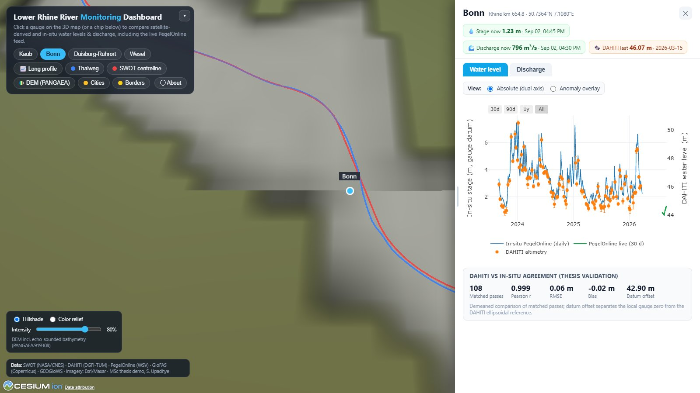
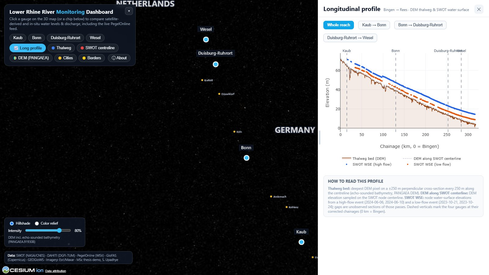

# Lower Rhine River Monitoring Dashboard

[](https://sharvil2410.github.io/Rhine-River-Monitoring/)
[](LICENSE)
[](https://cesium.com/platform/cesiumjs/)

A browser-based **digital twin of the Lower Rhine** (Bingen to Rees, 320 km). A CesiumJS globe on
3D terrain shows the four study gauges, Kaub, Bonn, Duisburg-Ruhrort and Wesel, with live water
levels and discharge from the PegelOnline API, satellite altimetry from DAHITI, and the SWOT-derived
discharge estimates from my MSc thesis at ITC, University of Twente.

**Open it:** <https://sharvil2410.github.io/Rhine-River-Monitoring/> (deep links: `#kaub`, `#bonn`,
`#duisburg_ruhrort`, `#wesel`, `#profile`).



## What it shows

- **Water level**: in-situ PegelOnline stage against DAHITI satellite altimetry, as a dual-axis plot or a
  demeaned anomaly overlay with DAHITI uncertainty bars, plus the thesis validation metrics.
- **Discharge**: in-situ PegelOnline discharge against SWOT **modified Manning** estimates. Switch
  between a fixed slope and the SWOT-observed slope, and between literature and calibrated Manning
  n. GloFAS and GEOGloWS can be toggled in the legend. Matched-pass skill metrics (n, r, RMSE, bias,
  NSE, KGE) are computed in the browser and agree with the offline pandas analysis.
- **Live layer**: the current measurement and the last 30 days of stage and discharge are fetched
  from the PegelOnline REST API on every page load, so the twin always shows the river now.
- **Terrain and DEM drape**: 3D terrain plus a draped DEM that includes echo-sounded channel
  bathymetry ([PANGAEA.919308](https://doi.pangaea.de/10.1594/PANGAEA.919308)). Hillshade or
  colour-relief rendering with an intensity slider.
- **Map layers**: the channel-centre thalweg (blue), the SWOT river centreline (red), country
  borders, city labels and a north arrow that always points true north.
- **Longitudinal profile**: channel-bed and DEM elevation along the full 320 km chainage, overlaid
  with SWOT water-surface profiles from a high-flow (June 2024) and a low-flow (October 2023) pass.
  Segment buttons zoom the chart and the 3D camera together.



## Architecture

The site is fully static: one `index.html` plus a `data/` folder. There is no backend.

```
raw sources                       build scripts (Python)              client (browser)
--------------------------        --------------------------------    ------------------------------
PegelOnline CSV exports   ---+
DAHITI altimetry          ---+--> build_dashboard_data.py  --------> data/stations_data.js
SWOT L2 river products    ---+    (15 min series to daily means,       (station series + metrics)
GloFAS / GEOGloWS         ---+     matched passes, metrics)
                                                                       index.html
1 m DEM GeoTIFF (84 GB)  -----> build_dem_tiles.py       --------> data/dem_tiles/{z}/{x}/{y}.png
                                  (Rasterio WarpedVRT stream,          (hillshade pyramid, z8 to z16)
                                   2 m hillshade, XYZ cut)
                            -----> build_dem_color_tiles.py --------> data/dem_tiles_color/...
                            -----> build_dem_layers.py      --------> data/dem/*.png (station patches)
Natural Earth 50 m        -----> build_borders.py          --------> data/borders.geojson
                                                                       live: PegelOnline REST (CORS *)
```

- **CesiumJS** renders the globe, terrain (ArcGIS World Elevation, no key needed), imagery, tile
  layers and entities. **Plotly** draws the charts.
- The DEM pipeline reads the 84 GB source once through a `WarpedVRT` (the file has no overviews and a
  degenerate CRS tag, so the CRS is forced to EPSG:25832), writes a 2 m hillshade GeoTIFF that also
  loads in QGIS, and cuts about 8,500 non-empty XYZ tiles.
- Everything in `data/` is generated. Regenerate it rather than editing it by hand.

## Run locally

```bash
git clone https://github.com/Sharvil2410/Rhine-River-Monitoring.git
cd Rhine-River-Monitoring
python -m http.server 8765
```

Then open <http://localhost:8765>. Serving over HTTP keeps the live PegelOnline fetch reliable.

## Rebuild the data

Requirements for the build scripts are in `requirements.txt` (`pip install -r requirements.txt`).

| Script | Produces | Notes |
|---|---|---|
| `build_dashboard_data.py` | `data/stations_data.js` | Reads the processed thesis CSVs; run after any data update |
| `build_dem_tiles.py` | `data/dem_tiles/` | About 30 min: streams the full DEM once, then cuts tiles |
| `build_dem_color_tiles.py` | `data/dem_tiles_color/` | Colour-relief pyramid with per-tile hillshade |
| `build_dem_layers.py` | `data/dem/` | 60 m reach overview and 4 m station patches |
| `build_borders.py` | `data/borders.geojson` | Germany and Netherlands from Natural Earth, simplified |

The DEM scripts expect the PANGAEA GeoTIFF under `data_raw/rhine_dem.tif` relative to the project
root; edit the path constant at the top of each script if yours differs.

## Deploy

Any static host works. This repository publishes the `gh-pages` branch through GitHub Pages:

```bash
git push origin main
git branch -f gh-pages main
git push origin gh-pages
```

Optional: paste a Google Maps Platform key (Map Tiles API) into `GOOGLE_MAPS_API_KEY` at the top of
the script block in `index.html` to switch to Google Photorealistic 3D Tiles.

## How it was built

Python (Rasterio, GDAL, GeoPandas, NumPy, pandas) for the data and tile pipelines, vanilla
JavaScript with CesiumJS and Plotly for the client, Git and GitHub Pages for delivery. Developed
alongside the thesis with an AI-assisted workflow (Claude Code) for code generation and review; all
numbers shown are reproduced by the scripts in this repository.

## Data credits

SWOT (NASA/CNES) · DAHITI (DGFI-TUM) · PegelOnline (WSV) · GloFAS (Copernicus) · GEOGloWS ·
DEM with echo-sounded bathymetry: PANGAEA.919308 · Imagery: Esri/Maxar · Terrain: Esri World
Elevation · Borders: Natural Earth.

## License

MIT, see [LICENSE](LICENSE). Data sources keep their own licences.
